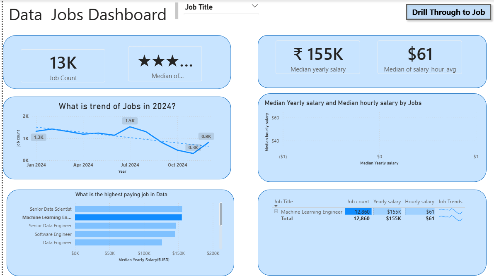
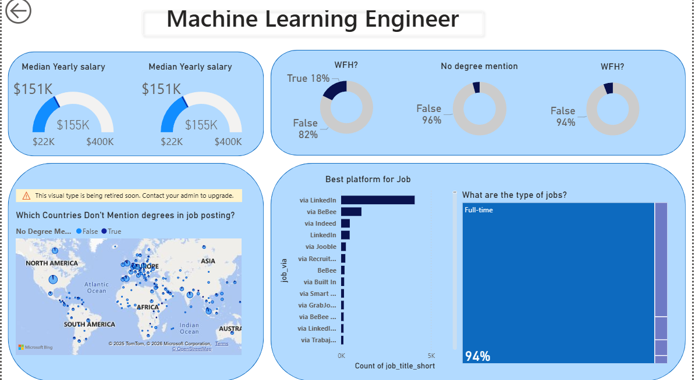
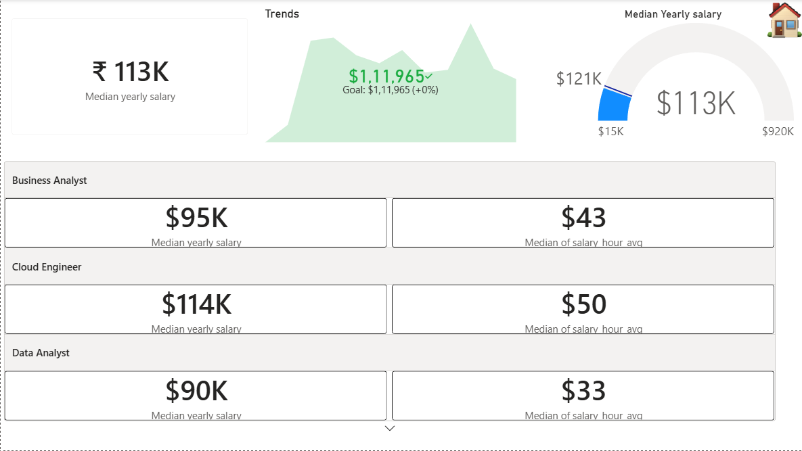
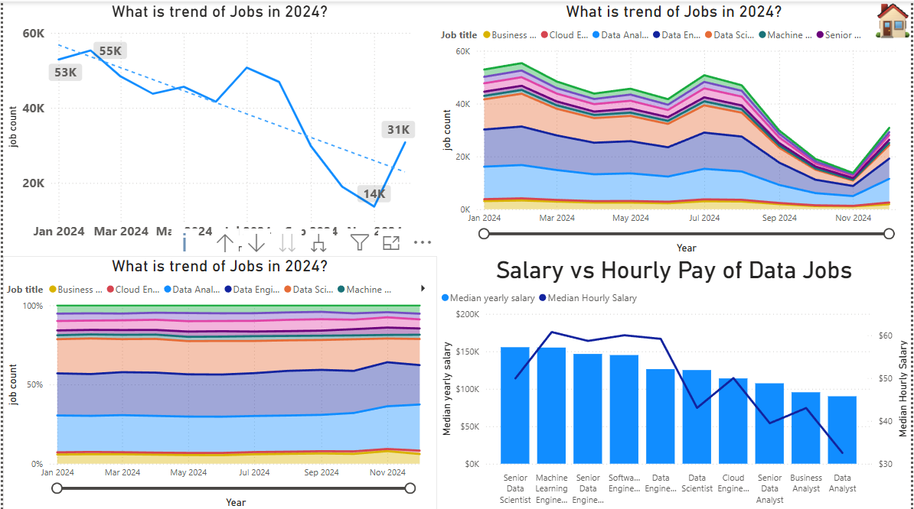

📊 Data Jobs Market Analysis Dashboard (2024)
📌 Project Overview

This project analyzes global data-related job postings to uncover trends across multiple roles such as:

Data Analyst

Data Engineer

Data Scientist

Machine Learning Engineer

Cloud Engineer

Senior Data Roles

The dashboard provides insights into job demand, salary trends, work-from-home availability, degree requirements, job types, and hiring platforms using real job posting data.

The goal of this project is to help:

Aspiring data professionals understand the job market

Recruiters analyze hiring trends

Analysts showcase data storytelling and dashboarding skills

🛠 Tools & Technologies Used

Power BI – Interactive dashboards & visualizations

SQL – Data extraction and transformations

Python (Pandas) – Data cleaning & preprocessing

Excel / CSV – Source data format

📂 Dataset Description

The dataset contains job posting information such as:

Job title & category

Salary (yearly & hourly)

Job posted date

Work from home availability

Degree requirement mention

Job type (Full-time, Contract, Internship)

Job platform source

Location (country-wise)

📸 Dashboard Screenshots

Add these images inside a screenshots/ folder in your GitHub repo

screenshots/
├── overall_dashboard.png
├── ml_engineer_dashboard.png
├── salary_trends.png
├── wfh_degree_analysis.png
├── job_trends_2024.png
## 📸 Dashboard Screenshots

### 🔹 Overall Data Jobs Dashboard

### 🔹 Machine Learning Engineer Dashboard

### 🔹 Salary vs Hourly Pay Analysis

### 🔹Salary Trends in 2024
.png)

### 🔹 Job Trends in 2024

📈 Key Insights & Findings

🔹 1. Job Market Overview

Total Job Postings: ~4.7 lakh

Most common job type:

✅ Full-time roles dominate (≈90–94%)

Internships and contract roles form a very small portion of the market.

🔹 2. Salary Insights

Overall Median Yearly Salary: $113K

Overall Median Hourly Salary: $48/hr

Highest Paying Roles:
Job Role	Median Yearly Salary

Senior Data Scientist	~$155K

Machine Learning Engineer	~$155K

Senior Data Engineer	~$147K

Software Engineer	~$145K

Data Engineer	~$125K

🔹 3. Job Trends in 2024

Job postings were strong in early 2024

Noticeable decline around Sep–Oct

Slight recovery towards end of the year

📉 This reflects seasonal hiring slowdowns and market corrections.

🔹 4. Work From Home (WFH) Analysis

Only 13–18% of job postings offer Work From Home

Majority of data roles are still on-site or hybrid

🔹 5. Degree Requirement Analysis

67% of jobs do NOT mention a degree

Senior roles mention degrees even less frequently

Indicates a shift towards skill-based hiring

🔹 6. Best Platforms for Data Jobs

Top job sources:

LinkedIn (dominant source)

Indeed

BeBee

Recruit & niche platforms

👉 LinkedIn is the most effective platform for data job searching.

🔹 7. Country-Level Insights

Higher salaries observed in:

United States

United Kingdom

France

India shows high job volume but relatively lower median salary

🎯 Business Questions Answered

Which data role pays the most?

How does salary compare between yearly vs hourly pay?

Are degrees mandatory for data jobs?

How common is remote work in data roles?

Which platforms post the most data jobs?

How did job demand change during 2024?

🚀 How to Use This Project

Clone the repository

Open the Power BI .pbix file

Use slicers to filter:

Job Title

Salary Range

Date

Location

Drill through individual job roles for deeper insights

📌 Future Enhancements

Add skill-level analysis (Python, SQL, ML, Cloud)

Predict salary using regression models

Add location-wise cost-of-living adjustments

Automate data refresh using APIs
